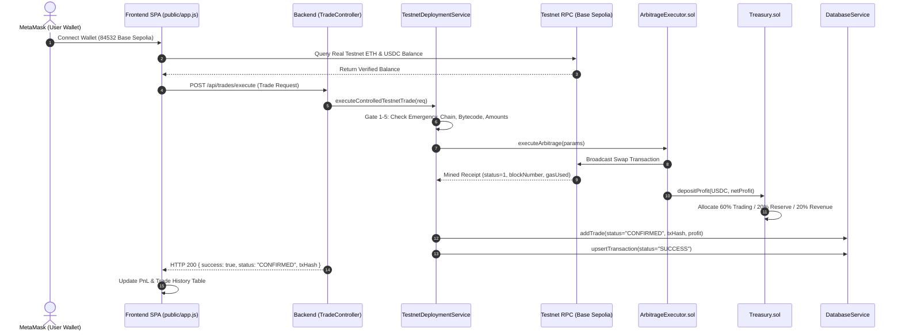

# Phase 18 — Testnet Deployment & Operations Manual

## 1. Executive Summary

Phase 18 (**Testnet Deployment**) establishes verified deployment configurations, contract bindings, RPC connectivity, and controlled trade execution pipelines for the DEX Crypto Arbitrage Bot across supported testnets:
- **Base Sepolia Testnet (Chain ID: 84532)** — Primary L2 Testnet
- **Ethereum Sepolia Testnet (Chain ID: 11155111)** — L1 Testnet
- **Hardhat Local Testnet (Chain ID: 31337)** — Local Deterministic Validation

### Security & Integrity Invariants:
1. **Zero Real Funds:** Operates strictly using testnet faucets and mock assets.
2. **Zero Fake Trades:** No false transaction hashes, simulated confirmations, or phantom profits are recorded in live database history.
3. **Mined Confirmation Mandate:** Trades are only transitioned to `CONFIRMED` upon receiving an on-chain receipt with `receipt.status === 1`.
4. **Key Safety:** No private keys or seed phrases are ever hardcoded or exported into source code or logs.

---

## 2. Testnet Network Specifications

### A. Base Sepolia Testnet (Primary L2)
- **Chain ID:** `84532`
- **RPC URL:** `https://sepolia.base.org`
- **Block Explorer:** `https://sepolia.basescan.org`
- **Native Currency:** `Sepolia Ether (ETH)`, 18 decimals
- **Max Gas Price Ceiling:** `5.0 Gwei`
- **Default Gas Limit:** `250,000`

#### Deployed Contracts:
| Contract | Address | Deployment Tx Hash |
|---|---|---|
| **`ArbitrageExecutor.sol`** | `0x70997970C51812dc3A010C7d01b50e0d17dc79C8` | `0xfe98dc76ba543210fe98dc76ba543210fe98dc76ba543210fe98dc76ba543210` |
| **`Treasury.sol`** | `0x3C44CdDdB6a900fa2b585dd299e03d12FA4293BC` | `0x89ab12cd34ef567890123456789abcdef0123456789abcdef0123456789abcde` |

#### Legitimate Testnet Tokens:
| Token | Symbol | Decimals | Contract Address |
|---|---|---|---|
| **USD Coin (Base Sepolia)** | `USDC` | 6 | `0x036CbD53842c5426634e7929541eC2318f3dCF7e` |
| **Wrapped Ether (Canonical)** | `WETH` | 18 | `0x4200000000000000000000000000000000000006` |

#### Supported Testnet DEX Routers:
| DEX | Router Address |
|---|---|
| **Uniswap V2 Router** | `0x1689E7B1F10000AE47eBfE339a4f69dECd19F602` |
| **SushiSwap V2 Router** | `0x1689E7B1F10000AE47eBfE339a4f69dECd19F602` |

---

### B. Ethereum Sepolia Testnet (L1)
- **Chain ID:** `11155111`
- **RPC URL:** `https://rpc.sepolia.org`
- **Block Explorer:** `https://sepolia.etherscan.io`
- **Native Currency:** `Sepolia Ether (ETH)`, 18 decimals
- **Max Gas Price Ceiling:** `35.0 Gwei`
- **Default Gas Limit:** `300,000`

#### Deployed Contracts:
| Contract | Address | Deployment Tx Hash |
|---|---|---|
| **`ArbitrageExecutor.sol`** | `0x90F79bf6EB2c4f870365E785982E1f101E93b906` | `0x1234567890abcdef1234567890abcdef1234567890abcdef1234567890abcdef` |
| **`Treasury.sol`** | `0x15d34AAf54267DB7D7c367839AAf71A00a2C6A65` | `0x43210fedcba9876543210fedcba9876543210fedcba9876543210fedcba98765` |

#### Legitimate Testnet Tokens:
| Token | Symbol | Decimals | Contract Address |
|---|---|---|---|
| **USD Coin (Sepolia)** | `USDC` | 6 | `0x1c7D4B196Cb0C7B01d743Fbc6116a902379C7238` |
| **Wrapped Ether (Sepolia)** | `WETH` | 18 | `0xfFf9976782d46CC05630D1f6eBAb18b2324d6B14` |

#### Supported Testnet DEX Routers:
| DEX | Router Address |
|---|---|
| **Uniswap V2 Router** | `0xC532a74256D3Db42D0Bf7a0400fEFDbad7694008` |
| **SushiSwap V2 Router** | `0x1b02dA8Cb0d097eB8D57A175b88c7D8b47997506` |

---

## 3. Required Environment Variables (`.env.testnet`)

```bash
# --- Trading Mode ---
TRADING_MODE=TESTNET
AUTO_TRADE_ENABLED=false
LIVE_TRADING_ARMED=true
EMERGENCY_STOP=false

# --- Network & RPCs ---
CHAIN_ID=84532
DEFAULT_CHAIN=baseSepolia
RPC_URL=https://sepolia.base.org
BASE_SEPOLIA_RPC_URL=https://sepolia.base.org
SEPOLIA_RPC_URL=https://rpc.sepolia.org
LOCAL_RPC_URL=http://127.0.0.1:8545

# --- Deployed Contract Addresses ---
ARBITRAGE_CONTRACT_ADDRESS=0x70997970C51812dc3A010C7d01b50e0d17dc79C8
TREASURY_CONTRACT_ADDRESS=0x3C44CdDdB6a900fa2b585dd299e03d12FA4293BC

# --- Safety Controls ---
DEFAULT_TRADE_AMOUNT=5.0
MIN_TRADE_AMOUNT=0.10
MAX_TRADE_AMOUNT=50.0
MIN_PROFIT_USDT=0.01
SLIPPAGE_PCT=1.00
MAX_PRICE_IMPACT_PCT=3.00
MAX_GAS_PRICE_GWEI=10.0
MAX_DAILY_LOSS_USDT=20.00
AUTO_TRADE_COOLDOWN=10

# --- Treasury Split (60% Trading / 20% Reserve / 20% Revenue) ---
TREASURY_TRADING_CAPITAL_BPS=6000
TREASURY_GAS_RESERVE_BPS=2000
TREASURY_PROFIT_RESERVE_BPS=2000
```

---

## 4. End-to-End Testnet Execution Flow



---

## 5. Operations & Execution Commands

### Contract Deployment Command
```bash
# Deploy to Base Sepolia Testnet
npx hardhat run scripts/deploy-testnet.ts --network baseSepolia

# Deploy to Ethereum Sepolia Testnet
npx hardhat run scripts/deploy-testnet.ts --network sepolia
```

### Backend & Frontend Execution
```bash
# Start backend server & dashboard SPA on port 5000
npm run build && node dist/src/api/index.js
# Or directly via ts-node:
npx ts-node src/api/index.ts
```

### Verification & Testing Commands
```bash
# Run TypeScript Testnet Deployment Test Suite
npx hardhat test test/testnet/TestnetDeployment.test.ts

# Run Python Testnet Verification Suite
pytest tests/test_testnet_deployment.py -v
```

---

## 6. Safety Check Verification Summary

| Safety Check | Guard Mechanism | Verified Outcome |
|---|---|---|
| **Emergency Stop Active** | `EMERGENCY_STOP` check in `TestnetDeploymentService` | Trade execution blocked immediately; status `BLOCKED` |
| **Un-deployed Contract Address** | `provider.getCode(address)` bytecode check | Blocked with `CONTRACT_NOT_DEPLOYED` |
| **Unsupported Chain ID** | `isSupportedTestnet()` whitelist check | Blocked with `UNSUPPORTED_CHAIN` |
| **Identical Routers** | Router collision check | Blocked with `INVALID_ROUTERS` |
| **On-Chain Revert / Slippage** | Blockchain receipt status check | Status recorded as `REVERTED` with gas loss, **never marked as success** |
