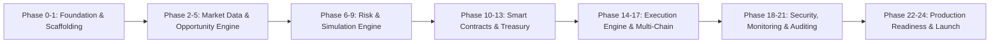

# DEX Arbitrage Bot — Complete 24-Phase Master Roadmap

This document outlines the end-to-end 24-phase development lifecycle for the production-grade DEX Arbitrage & Treasury System.

---

## Roadmap Phases Overview

---

### Phase 0: Project Definition & Architecture (Current Phase)
- **Deliverables**: Project Charter, Architecture Design Document, Security Policies, Roadmap, Master Specifications.
- **Milestone**: Full system blueprint and risk boundaries codified.

### Phase 1: Project Setup & Developer Environment (Current Phase)
- **Deliverables**: TypeScript/Node.js tooling, Hardhat multi-chain configuration, Solidity compiler optimizations, package dependencies, environment templates (`.env.example`), testing frameworks (Mocha/Chai + PyTest), linting (`eslint`, `solhint`, `prettier`), and placeholder module interfaces.
- **Milestone**: Clean, compilable, lintable, testable workspace foundation.

---

### Phase 2: Multi-Chain Network & RPC Infrastructure
- **Deliverables**: Resilient RPC failover manager, WebSocket event listeners, multi-chain providers (Base, Arbitrum, Polygon, Ethereum, Sepolia), block listener, gas fee tracker with EIP-1559 base + priority fee calculations.

### Phase 3: Token & DEX Pool Registry
- **Deliverables**: On-chain pool discovery, token metadata cache (decimals, symbols, addresses), factory contract listeners, reserves cache with atomic memory synchronization.

### Phase 4: Market Data Ingestion & Orderbook/Reserve Engine
- **Deliverables**: Real-time DEX pool reserve stream, sub-100ms reserve updates, triangular pool graph builder, constant-product ($xy=k$) and concentrated liquidity models.

### Phase 5: Arbitrage Opportunity Detection Engine
- **Deliverables**: 2-leg direct arbitrage and 3-leg triangular route scanner, pathfinding algorithm (Bellman-Ford / modified Dijkstra), dynamic spread computation.

### Phase 6: Optimal Trade Sizing & Calculus
- **Deliverables**: Closed-form calculus and golden-section search for optimal input notional $x^* = \frac{\sqrt{r_1 r_2 \gamma_1 \gamma_2} - r_1}{\gamma_1}$, liquidity depth scaling, price impact bounds.

### Phase 7: Profit Calculation & Fee Modeling
- **Deliverables**: Complete Net Profit engine accounting for protocol swap fees (0.3% / tiered), L1 data availability fees (Base/Arbitrum), L2 execution gas, slippage, and ROI calculation.

### Phase 8: Risk Management & Safety Gates
- **Deliverables**: 10-Gate risk control pipeline: Whitelists, max slippage ceiling, price impact limit, max gas price, daily loss circuit breaker, consecutive failure circuit breaker, emergency stop switch.

### Phase 9: Real-Time Pre-Execution Recalculation Engine
- **Deliverables**: Zero-latency recheck directly before transaction broadcast, fresh mempool/block state verification, slippage recalculation.

### Phase 10: Transaction Simulation Engine
- **Deliverables**: RPC pre-flight simulation via `eth_call`, trace inspection, gas unit estimation, simulated net return verification.

### Phase 11: Solidity Execution Smart Contracts (`ArbitrageExecutor.sol`)
- **Deliverables**: Atomic multi-swap smart contract, reentrancy guards, token & router whitelisting, emergency pause, deterministic revert on net loss (`require(balanceAfter > balanceBefore, 'UNPROFITABLE')`).

### Phase 12: Flash Loan Integration (Optional / Advanced)
- **Deliverables**: Aave V3 / Balancer Flash Loans integration into `ArbitrageExecutor.sol` for capital-free atomic arbitrage.

### Phase 13: Treasury Smart Contract (`Treasury.sol`)
- **Deliverables**: Multi-bucket enterprise vault (`TRADING_CAPITAL`, `GAS_RESERVE`, `PROFIT_RESERVE`, `EMERGENCY_RESERVE`), basis points (BPS) distribution configuration, controlled withdrawal access controls.

### Phase 14: Automated Profit Distribution System
- **Deliverables**: Automated 60/20/20 revenue allocation engine, compounding reinvestment trigger, database allocation ledger.

### Phase 15: Non-Custodial Web3 Execution Engine
- **Deliverables**: MetaMask / EIP-1193 client-side signing bridge, server isolated signer fallback, transaction nonce manager, replacement/speedup transaction logic.

### Phase 16: Multi-Chain Network Routing & Auto-Switch
- **Deliverables**: Seamless network routing, dynamic chain state switching, multi-chain gas estimation normalization.

### Phase 17: Database & Persistence Layer
- **Deliverables**: Production database schema (Tokens, Pools, Opportunities, Trades, Withdrawals, Allocations), automated migration scripts, backup/restore pipelines.

### Phase 18: Security Hardening & Threat Modeling
- **Deliverables**: Threat model analysis (sandwich attack protection, MEV-private RPC routing via Flashbots/Eden, private key isolation, contract static analysis via Slither).

### Phase 19: Comprehensive Testing Suite
- **Deliverables**: Unit tests, integration tests, contract fuzzing with Foundry/Hardhat, mainnet fork simulations, historical scenario backtests.

### Phase 20: Performance Optimization & Sub-Cent Latency Tuning
- **Deliverables**: Multi-threaded Python/Node.js pipeline, connection pooling, zero-allocation memory buffers, hot-path execution profiling.

### Phase 21: Real-Time Monitoring & Web3 Dashboard
- **Deliverables**: Unified Web3 operations terminal, live chart widgets, pool depth gauge, multi-bucket treasury interface, audit log export (CSV/JSON), audio alerts.

### Phase 22: Testnet Staging & Dry-Run Validation
- **Deliverables**: End-to-end dry-run execution on Sepolia and Base Sepolia testnets, faucet management, stress-testing under simulated network congestion.

### Phase 23: Deployment & DevOps Automation
- **Deliverables**: Smart contract verification on Etherscan/Basescan, automated CI/CD pipeline, Docker containerization, health check and uptime monitor.

### Phase 24: Mainnet Launch & Go-Live Checklist
- **Deliverables**: Phased capital rollout ($10 -> $50 -> $200 -> scaling), killswitch verification, real-time alerting, post-launch audit.

---

## Current Status: Phase 0 & Phase 1 In Progress
- **Next Step after Phase 1 Approval**: Phase 2 (Multi-Chain Network & RPC Infrastructure).
