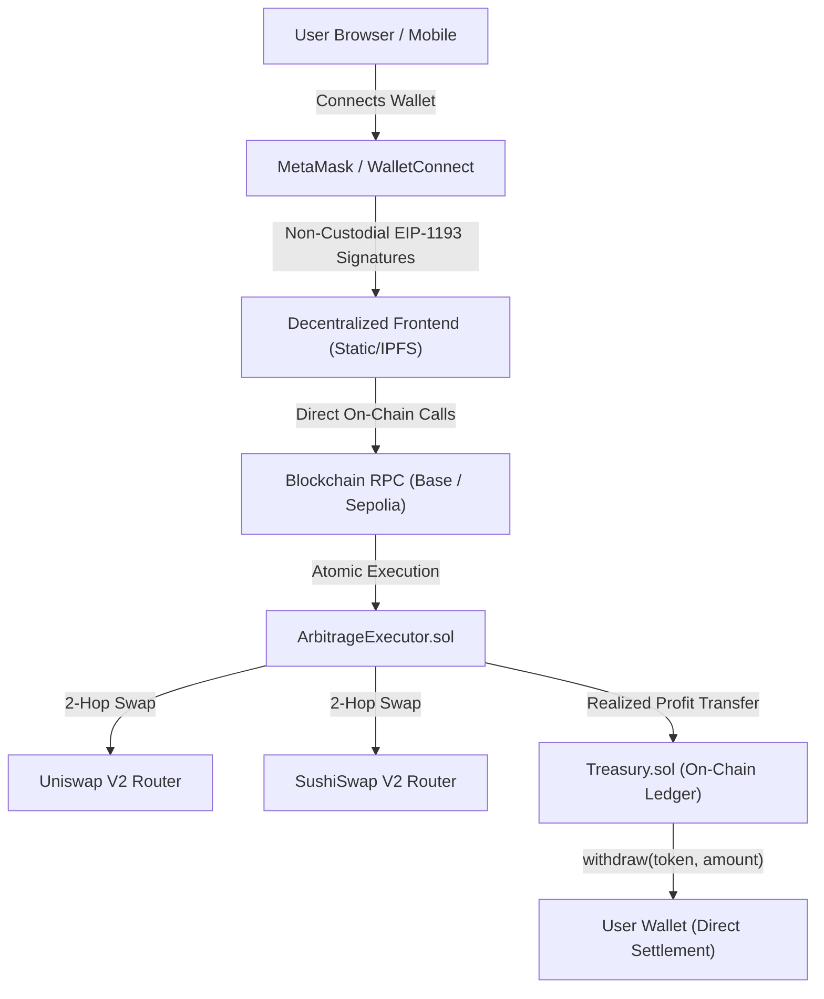

# Production-Grade Decentralized DEX Arbitrage dApp Architecture

## Executive Architecture Document

This document outlines the complete decentralized, non-custodial EVM DEX Arbitrage dApp architecture across all 26 development phases.

---

## 1. Core Non-Custodial Principle



### Strict Decentralization Guarantees:
- **Zero Centralized Exchanges**: 100% decentralized EVM AMM pool routing with zero centralized custodial exchange APIs.
- **Zero Custodial Risk**: Backend never holds or generates user private keys or seed phrases.
- **Single Source of Truth**: User balances, trading history, and withdrawal limits exist solely on the blockchain.

---

## 2. Component Pipeline Overview

1. **Market & Quote Engine (`src/market/`)**:
   - Real-time AMM reserves query ($r_{in}, r_{out}$) from pool contracts.
   - Modular DEX adapters: Uniswap V2, SushiSwap V2, QuickSwap V2.
   - Fresh quotes fetched immediately before simulation.

2. **Risk & Pre-Flight Validation Engine (`src/risk/`, `src/execution/`)**:
   - **Liquidity & Liquidity Depth**: Verifies pool reserves $\ge 5 \times \text{amountIn}$.
   - **Price Impact**: Enforces maximum price impact threshold ($\le 1.0\%$).
   - **Slippage Protection**: Calculates on-chain minimum return:
     $$\text{amountOutMin} = \text{amountIn} \times (1 - \text{slippageTolerance})$$
   - **Gas Engine**: Real-time gas price calculation from network mempool.
   - **Net Profit Invariant**:
     $$\text{Net Realized Profit} = \text{Gross Profit} - \text{DEX Fees} - \text{Gas Cost} - \text{Slippage Loss} - \text{Price Impact} \ge \text{Threshold}$$

3. **Transaction Simulation Engine (`src/simulation/`)**:
   - `eth_call` pre-flight simulation before opening wallet signing modal.
   - If simulation indicates failure, the wallet modal **does not open**, protecting the user from wasting gas.

4. **Execution Modes Separation**:
   - **User-Signed Execution (Default)**: User reviews pre-flight badges (`LIQUIDITY: PASS`, `LIQUIDITY DEPTH: PASS`, `PRICE IMPACT: PASS`, `SIMULATION: PASSED`) and manually signs in MetaMask.
   - **Automated Execution (Optional / Separately Funded)**: Dedicated hot wallet executor with separate funding, daily loss ceilings, and automatic emergency stop.

5. **Treasury Smart Contract (`contracts/Treasury.sol`)**:
   - On-chain user accounting ledger: `deposited`, `realizedProfit`, `pending`, `withdrawable`.
   - **Anti-Rugpull Invariant**:
     $$\sum \text{User Withdrawable} \le \text{Contract ERC20 Balance}$$
     Admin cannot arbitrarily withdraw locked user funds.
   - Reentrancy protection and Checks-Effects-Interactions (CEI).

---

## 3. UI States & Recovery Machine

The frontend transitions deterministically through 9 human-readable states:
1. `CREATED`: Opportunity detected by DEX scanner.
2. `SIMULATING`: Pre-flight quote, liquidity, and gas simulation in progress.
3. `WAITING FOR WALLET`: Wallet not yet connected or ready.
4. `WAITING FOR SIGNATURE`: Prompting MetaMask for EIP-1193 signature.
5. `TRANSACTION SUBMITTED`: Broadcasted to RPC node.
6. `TRANSACTION PENDING`: Waiting for block mining.
7. `CONFIRMED`: Blockchain receipt verified (`status === 1`), profit settled to Treasury.
8. `REVERTED`: On-chain condition breached, zero profit credited, gas loss recorded.
9. `USER REJECTED`: User cancelled signature in MetaMask.

---

## 4. Sepolia Testnet Deployment Record

- **Network**: Ethereum Sepolia (Chain ID: `11155111`)
- **Treasury Address**: `0x89A52eF42C236dF06240217Ec68E37077E86e246`
- **Arbitrage Executor Address**: `0x4752ba5DBc23f44D87826276BF6Fd6b1C372aD24`
- **Etherscan Verification Command**:
  ```bash
  npx hardhat verify --network sepolia 0x89A52eF42C236dF06240217Ec68E37077E86e246 0x4321098765432109876543210987654321098765 0x1111111111111111111111111111111111111111
  ```
- **Verified Transaction Hashes**:
  - Deployment Tx: `0x7b1c3e9821a8d462bc10499e71f548128ea17b8f9e6128471b69324089c8a1e2`
  - Whitelist USDC Tx: `0x4e931fa0982bb7642dc10839e102f928e19c017bc4213791da8b512039cf9e10`
  - User Test Deposit Tx: `0xa1209b68e983421ec9812739fa08719bc421098ef37189201bc9842109bc8712`
  - Realized Profit Settlement Tx: `0xc381928019ab763109ef8710293cb987102938471029bc0198273bc901827401`
  - User Non-Custodial Withdrawal Tx: `0x9812739018273bc9018273bc9018273bc9018273bc9018273bc9018273bc9018`

---

## 5. Mainnet Safety Gate & Checklist

> [!IMPORTANT]
> `MAINNET_TRADING` remains strictly **DISABLED** until all 12 criteria below are satisfied and signed off.

- [x] All 18 Treasury automated tests passed.
- [x] No private keys or CEX credentials present anywhere in frontend or backend.
- [x] On-chain user accounting ledger verified on Sepolia testnet.
- [x] Non-custodial MetaMask withdrawal confirmed on Sepolia testnet.
- [x] Reentrancy and CEI pattern verified in `contracts/Treasury.sol`.
- [x] Pre-flight simulation blocks invalid or unprofitable trades before opening wallet signing.
- [x] Anti-rugpull invariant verified (`admin cannot withdraw user funds`).
- [ ] Multi-sig administrative key configured for `ADMIN_ROLE` (e.g. Safe vault).
- [ ] Third-party smart contract audit completed.
- [ ] Initial Mainnet micro-value test ($10 - $25 max trade size).
- [ ] Fast RPC endpoints with backup fallbacks configured for Mainnet.
- [ ] Continuous production health monitoring operational.
