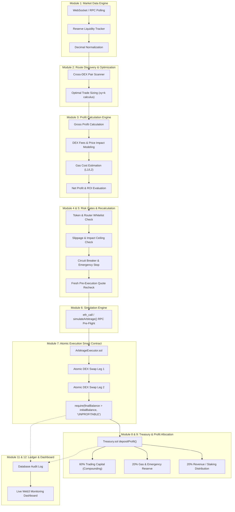

# DEX Arbitrage Bot & Treasury System — Project Charter

## 1. Project Objective & Vision
The objective of this project is to build an enterprise-grade, high-performance, non-custodial **Decentralized Exchange (DEX) Arbitrage & Treasury System**. The system continuously monitors cross-DEX price discrepancies, models atomic triangular and cross-venue execution routes, validates multi-tier risk gates, conducts pre-flight RPC simulations, executes atomic zero-loss on-chain swaps via smart contracts, and systematically directs net profits into an automated Multi-Bucket Treasury.

## 2. Fundamental Architectural Principles

### 2.1 Zero-Loss Atomic Execution
- **Strict Atomicity**: Every trade must be executed within a single on-chain transaction.
- **Zero-Loss Guarantee**: If the final realized return is less than or equal to the initial capital plus gas and protocol fees (`Net Profit <= 0`), the transaction must automatically and deterministically revert.
- **Capital Preservation**: Never risk principal funds. Failed trades must only consume minimal gas, with zero capital attrition.

### 2.2 Non-Custodial Security & Key Management
- No centralized exchange (CEX) APIs, keys, or custody.
- All execution paths support client-side signing (MetaMask / EIP-1193) or dedicated hardware/isolated signer enclaves.
- No private keys are ever stored in version control, logs, client browsers, or unencrypted persistent storage.

### 2.3 Comprehensive Profit Calculation (No Quoted Spreads as Profit)
- Gross Profit does not equal Net Profit.
- Every opportunity must account for:
  $$\text{Net Profit} = \text{Estimated Return} - \text{Input Notional} - \text{DEX Swap Fees (e.g. 0.30\% per leg)} - \text{Price Impact} - \text{Gas Costs (L1 + L2 execution)}$$
- Execution is strictly gated on:
  $$\text{Net Profit} > \text{Min Net Profit Threshold} \quad \text{AND} \quad \text{ROI (\%)} \ge \text{Min ROI Threshold}$$

### 2.4 Multi-Tier Automated Treasury & Compounding
- 100% of realized profits forwarded atomically to `Treasury.sol`.
- Configurable basis points (BPS) distribution:
  - **60% (6000 bps) — Trading Capital**: Auto-compounded into the trading inventory.
  - **20% (2000 bps) — Reserve / Gas Pool**: Volatility buffer and gas subsidy reserve.
  - **20% (2000 bps) — Revenue / Staking**: Protocol yield and founder distribution.

## 3. High-Level Modular Architecture

## 4. Multi-Chain Target Matrix

| Network | Chain ID | DEX Protocols | Gas Profile | Optimization Goal |
| :--- | :---: | :--- | :--- | :--- |
| **Base L2** | `8453` | Uniswap V2/V3, SushiSwap, Aerodrome | Sub-cent gas (< $0.005) | Micro-arbitrage, 95%+ profit retention |
| **Arbitrum One** | `42161` | Uniswap V3, SushiSwap, Camelot | Low gas (~$0.01) | Fast block time (~250ms Nitro) |
| **Polygon PoS** | `137` | QuickSwap, SushiSwap, Uniswap V3 | Low gas (~0.02 POL) | High volume multi-pair scanning |
| **Ethereum Mainnet** | `1` | Uniswap V2/V3, SushiSwap, Curve | High gas ($2.00 - $20.00+) | Large capital triangular trades |
| **Sepolia Testnet** | `11155111` | Uniswap V2, SushiSwap V2 | Free testnet faucet | Safe staging & execution rehearsal |
| **Base Sepolia** | `84532` | Uniswap V2/V3, SushiSwap V2 | Free testnet faucet | L2 staging & simulation rehearsal |

## 5. Phase 0 Deliverable Sign-Off
- Architecture fully documented.
- Security and risk boundaries codified.
- Ready for Phase 1 project scaffolding and tooling configuration.
