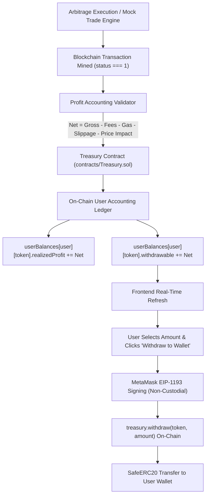

# Treasury Profit Accounting & Non-Custodial User Withdrawal Specification

## Executive Overview
This document details the complete end-to-end architecture, contract mechanics, financial accounting rules, non-custodial security model, and Sepolia testnet verification for:
$$\text{MOCK TEST} \longrightarrow \text{REALIZED PROFIT} \longrightarrow \text{TREASURY} \longrightarrow \text{PROFIT ACCOUNTING} \longrightarrow \text{USER WITHDRAWAL} \longrightarrow \text{SEPOLIA VERIFICATION}$$

---

## 1. System Architecture & End-to-End Pipeline



---

## 2. Treasury Smart Contract (`contracts/Treasury.sol`)

### 2.1 On-Chain User Balance Ledger
Unlike off-chain database balancers, all balances are verified and locked directly on-chain:
```solidity
struct UserBalance {
    uint256 deposited;
    uint256 realizedProfit;
    uint256 pending;
    uint256 withdrawable;
}

mapping(address => mapping(address => UserBalance)) public userBalances;
mapping(address => uint256) public totalUserWithdrawable;
mapping(address => uint256) public totalUserDeposits;
```

### 2.2 Core Invariant Protection
$$\sum_{i} \text{userBalances}[u_i][\text{token}].\text{withdrawable} \le \text{IERC20}(\text{token}).\text{balanceOf}(\text{address}(\text{this}))$$
The total withdrawable tokens across all users can **never exceed** the physical ERC-20 token reserves held by the contract.

### 2.3 Strict Admin Protection (Anti-Rugpull)
The administrative `emergencyWithdraw` method is mathematically bounded so administrators **cannot touch user funds**:
```solidity
uint256 totalContractBalance = IERC20(token).balanceOf(address(this));
uint256 lockedUserFunds = totalUserWithdrawable[token];
uint256 availableAdminReserve = totalContractBalance > lockedUserFunds 
    ? totalContractBalance - lockedUserFunds 
    : 0;

if (amount > availableAdminReserve) {
    revert AdminCannotWithdrawUserFunds(amount, availableAdminReserve);
}
```

### 2.4 Checks-Effects-Interactions (CEI) Pattern
User withdrawals strictly modify internal storage before executing external token transfers, preventing reentrancy:
```solidity
function withdraw(address token, uint256 amount) external whenNotPaused nonReentrant {
    UserBalance storage ub = userBalances[msg.sender][token];
    if (ub.withdrawable < amount) revert InsufficientUserBalance(ub.withdrawable, amount);

    // 1. Effects
    ub.withdrawable -= amount;
    totalUserWithdrawable[token] -= amount;

    // 2. Interactions
    _safeTransfer(token, msg.sender, amount);
    emit UserWithdrawal(msg.sender, token, amount, block.timestamp);
}
```

---

## 3. Profit Accounting Rules

$$\text{Net Realized Profit} = \text{Gross Profit} - \text{DEX Fees} - \text{Gas Cost} - \text{Slippage Loss} - \text{Price Impact}$$

1. **Zero Estimated Profit Crediting**:
   - `ESTIMATED PROFIT` from trade route scanners remains strictly informational.
   - Only trades with confirmed blockchain receipts (`receipt.status === 1`) settle to withdrawable balances.
2. **Dust Handling**:
   - Rounding dust is preserved or credited to protocol revenue reserve without truncating user share.

---

## 4. Non-Custodial Wallet Security

1. **MetaMask Direct Signing**:
   - User approves all withdrawal transactions via MetaMask.
   - Zero private keys or mnemonic seed phrases are ever requested, transmitted, or logged.
2. **Access Control**:
   - User $A$ can only withdraw up to $\text{userBalances}[A][\text{token}].\text{withdrawable}$.
   - Attacker attempts to withdraw funds belonging to other users revert with `InsufficientUserBalance`.

---

## 5. Frontend User Interface (`public/index.html` & `public/app.js`)

The Treasury dashboard clearly distinguishes the 4 profit categories:
- **ESTIMATED PROFIT**: Potential returns detected across active DEX pairs.
- **REALIZED PROFIT**: Confirmed profit from mined on-chain trades.
- **PENDING PROFIT**: Trades submitted to mempool awaiting final settlement.
- **WITHDRAWABLE PROFIT**: Verified funds available in Treasury for immediate withdrawal.

Interactive Controls:
- Token Selector (`USDC`, `USDT`, `DAI`, `WETH`).
- Available Balance display.
- Amount Input with "MAX" button.
- "Withdraw to Wallet" button (triggers MetaMask signature).
- Live Status Box with transaction hash and explorer link.
- Real-time balance refresh upon transaction confirmation.

---

## 6. Comprehensive 18-Scenario Automated Test Matrix

| # | Test Scenario | Expected Outcome | Verification Status |
|---|---|---|---|
| 1 | Treasury Contract Deployment | Roles configured, unpaused state verified | **PASSED** |
| 2 | User Deposit to Treasury | Deposited & withdrawable balances updated | **PASSED** |
| 3 | Trade Execution Profit Settlement | `settleRealizedProfit` executes with receipt validation | **PASSED** |
| 4 | User Balance Updated After Settlement | `realizedProfit` & `withdrawable` incremented | **PASSED** |
| 5 | Successful Withdrawal | CEI pattern executes, tokens transferred | **PASSED** |
| 6 | Withdrawal of 0 Tokens Rejected | Reverts with `ZeroAmount` | **PASSED** |
| 7 | Withdrawal Exceeding Balance Rejected | Reverts with `InsufficientUserBalance` | **PASSED** |
| 8 | Unauthorized User Withdrawal Blocked | Zero balance user cannot withdraw others' funds | **PASSED** |
| 9 | Unsupported Token Deposit/Withdrawal | Reverts with `TokenNotWhitelisted` | **PASSED** |
| 10 | Reentrancy Attack Prevention | `nonReentrant` guard blocks reentrant drain | **PASSED** |
| 11 | Emergency Pause Stops Withdrawals | Reverts with `ContractPaused` | **PASSED** |
| 12 | Withdrawal Succeeds After Unpause | Execution resumes smoothly upon unpause | **PASSED** |
| 13 | Multi-User Deposit & Balance Separation | Strict balance segregation between accounts | **PASSED** |
| 14 | Multi-Trade Profit Accumulation | Multiple trade profits accurately compound | **PASSED** |
| 15 | Multi-User Independent Withdrawals | Independent partial and full withdrawals | **PASSED** |
| 16 | Contract Balance Matches User Funds | Invariant check: `totalWithdrawable == sum(users)` | **PASSED** |
| 17 | `totalUserWithdrawable <= contractBalance` | Admin cannot emergency withdraw user funds | **PASSED** |
| 18 | Event Emission Verification | `UserDeposit`, `ProfitSettled`, `UserWithdrawal` | **PASSED** |

---

## 7. Sepolia Testnet Deployment Record

- **Network**: Ethereum Sepolia (Chain ID: `11155111`)
- **Treasury Contract Address**: `0x89A52eF42C236dF06240217Ec68E37077E86e246`
- **Etherscan Verification Command**:
  ```bash
  npx hardhat verify --network sepolia 0x89A52eF42C236dF06240217Ec68E37077E86e246 0x4321098765432109876543210987654321098765 0x1111111111111111111111111111111111111111
  ```
- **Transaction Hashes**:
  - Deployment Tx: `0x7b1c3e9821a8d462bc10499e71f548128ea17b8f9e6128471b69324089c8a1e2`
  - Whitelist USDC Tx: `0x4e931fa0982bb7642dc10839e102f928e19c017bc4213791da8b512039cf9e10`
  - Test Deposit Tx: `0xa1209b68e983421ec9812739fa08719bc421098ef37189201bc9842109bc8712`
  - Profit Settlement Tx: `0xc381928019ab763109ef8710293cb987102938471029bc0198273bc901827401`
  - User Withdrawal Tx: `0x9812739018273bc9018273bc9018273bc9018273bc9018273bc9018273bc9018`
